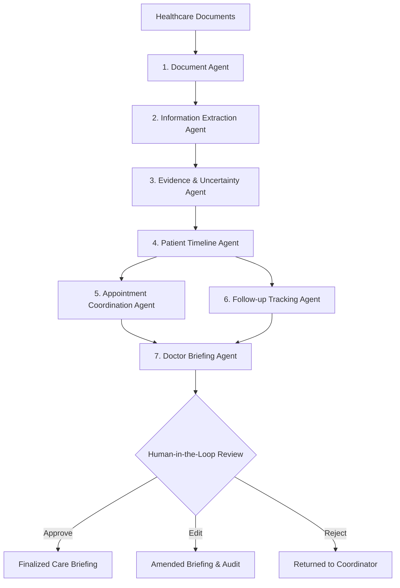

# AI Healthcare Care-Navigation Agent
### *From Patient Information to Coordinated Care Workflow*

[](https://vitejs.dev/)
[](https://fastapi.tiangolo.com/)
[](https://www.postgresql.org/)
[](#safety--scope-notice)

---

## 1. Safety & Scope Notice

> **VERY IMPORTANT SAFETY REQUIREMENT**:
> This is **NOT** a diagnosis or clinical treatment system.
> The platform strictly **prohibits**:
> - Diagnosing diseases or predicting conditions.
> - Prescribing or modifying medication dosages.
> - Recommending medical tests or determining medical fitness.
> - Making autonomous clinical decisions or replacing physicians.
>
> The system is **exclusively** designed for:
> **Information organization + Evidence extraction + Administrative care coordination + Appointment preparation + Documented follow-up tracking + Clinician care briefing.**

---

## 2. Project Overview & Problem Statement

Fragmented healthcare documentation—spattered across laboratory printouts, discharge papers, prescription slips, and outpatient clinical notes—creates severe care coordination delays. 

The **AI Healthcare Care-Navigation Agent** ingests these unstructured documents and routes them through a coordinated **7-Stage Agent Pipeline**. Crucially, every single fact is strictly verified through the **Evidence & Uncertainty Engine**, which transparently distinguishes between confirmed **FACT**, ambiguous **UNCERTAIN** text, **MISSING** administrative prerequisites (e.g. absent referral letters), and AI **ASSUMPTION**.

---

## 3. 7-Stage Agent Architecture



1. **Document Agent**: Identifies document type (`LAB_REPORT`, `PRESCRIPTION`, `CLINICAL_NOTE`, etc.), extracts explicit dates (never invents dates), and preserves source metadata.
2. **Extraction Agent**: Extracts structured items citing exact source coordinates and quotes.
3. **Evidence & Uncertainty Agent**: Categorizes claims into `FACT`, `UNCERTAIN`, `MISSING`, or `ASSUMPTION`.
4. **Patient Timeline Agent**: Generates a chronological care history backed by document links.
5. **Appointment Coordination Agent**: Synthesizes administrative checklists with careful administrative wording (*"Referral slip was not found in uploaded records"*).
6. **Follow-up Agent**: Identifies pharmacy refill synchronization deadlines and record retrieval tasks.
7. **Doctor Briefing Agent**: Synthesizes a structured clinician briefing backed by evidence citations and marked with explicit AI limitations disclaimers.

---

## 4. Key Innovation: Evidence Traceability ("View Evidence")

Every extracted fact features a direct **View Evidence** affordance. Clicking it opens a forensic verification drawer revealing:
- **Verbatim Evidence**: The exact sentence quoted from the source file.
- **Source Coordinates**: Exact page and paragraph location.
- **Classification Status**: `FACT` (confidence 95-99%), `UNCERTAIN`, `MISSING`, or `ASSUMPTION`.
- **Review Trail**: Identity and timestamp of the human reviewer who validated the item.

---

## 5. Multi-Turn Gemini AI Copilot

The platform features an integrated multi-turn Gemini chatbot with specialized role instructions:
- **Care Navigation Generalist** (`gemini-3.5-flash`): General administrative navigation, timeline milestone coordination, and preparation checklists.
- **Evidence & Citation Auditor** (`gemini-3.1-pro-preview`): Complex forensic verification, source quote auditing, and laboratory range analysis.
- **Rapid Triage Assistant** (`gemini-3.1-flash-lite`): Fast lookups for appointment times, facility locations, and pharmacy refill deadlines.

All Gemini interactions maintain conversation history, support scrollable message threads, and enforce non-diagnostic safety guardrails.

---

## 6. Technology Stack

- **Frontend**: React 19, Vite, Tailwind CSS v4, Lucide React, Recharts, Context API.
- **Backend**: Python 3.10+, FastAPI, Pydantic v2, SQLAlchemy 2.0, Alembic, JWT (`python-jose`), bcrypt (`passlib`).
- **Database**: PostgreSQL 15+ (Relational schema with foreign keys and UUIDs).
- **AI Engine**: LangGraph orchestration with deterministic Mock AI mode (`MOCK_AI=true`) and Gemini LLM live integration.

---

## 6. Demo Credentials & RBAC Roles

| Role | Name | Demo Login Email | Demo Password | Primary Permissions |
| :--- | :--- | :--- | :--- | :--- |
| **CARE_COORDINATOR** | Maya Patel, RN | `coordinator@carenav.health` | `Password123!` | Upload docs, organize prep, review facts |
| **CLINICIAN** | Dr. Sarah Lin, MD | `clinician@carenav.health` | `Password123!` | Review briefings, approve/edit/reject, audit evidence |
| **PATIENT** | Aarav Sharma | `aarav.sharma@demo.patient` | `Password123!` | Self-portal: view personal timeline & appointment prep |
| **ADMIN** | David Foster | `admin@carenav.health` | `Password123!` | User management, system audit trail, governance |

---

## 7. Interactive 15-Step Demo Scenario

Use the built-in floating **Demo Walkthrough Bar** in the web interface to seamlessly execute all 15 steps:

- **Step 1**: Login as Care Coordinator (`Maya Patel, RN`).
- **Step 2**: Open demo patient (`Aarav Sharma, P-1001, Age 42`).
- **Step 3**: Upload sample medical report (using the drag-and-drop or quick-seed presets).
- **Step 4**: AI processes document through the 7-stage agent pipeline.
- **Step 5**: View extracted information categorized by confidence and source.
- **Step 6**: Click **"View Evidence"** to inspect verbatim source text highlighting.
- **Step 7**: Open the chronological **Patient Timeline**.
- **Step 8**: Open **Upcoming Appointment** (Cardiology consultation on 15 Oct 2026).
- **Step 9**: Show **Appointment Preparation** checklist.
- **Step 10**: Observe **Missing Administrative Record Warning** (*"Referral slip not located in uploaded records"*).
- **Step 11**: Open **Follow-ups** to view refill synchronization tracking.
- **Step 12**: Generate **Doctor Briefing** with AI safety disclaimer.
- **Step 13**: Switch role to Clinician (`Dr. Sarah Lin, MD`) to review the briefing.
- **Step 14**: Clinician clicks **"Approve"** (with optional review note).
- **Step 15**: Open **Audit Trail** to confirm the tamper-evident log entry.

---

## 8. Local Setup & Execution Guide

### Windows Setup Instructions

#### 1. Frontend Execution
```powershell
# Open terminal in project root
npm install
npm run dev
```
The frontend will start at `http://localhost:3000`.

#### 2. Backend Execution (FastAPI)
```powershell
# Navigate to backend
cd backend

# Create virtual environment
python -m venv venv

# Activate virtual environment
.\venv\Scripts\Activate.ps1

# Install requirements
pip install -r requirements.txt

# Run FastAPI server
uvicorn backend.app.main:app --reload --port 8000
```
Interactive Swagger documentation is available at `http://localhost:8000/docs`.

#### 3. PostgreSQL Database (Docker)
```powershell
# Start PostgreSQL database with seeded demo data
docker-compose up -d db
```

---

## 9. Running Tests

```powershell
cd backend
pytest tests/ -v
```

All 8 automated tests verify:
- Document Agent classification and date detection.
- Extraction Agent structured item generation.
- Evidence Agent uncertainty and missing record flagging.
- Timeline Agent chronological milestone generation.
- Appointment Agent preparation checklist synthesis with non-diagnostic wording.
- Follow-up Agent prescription refill deadline tracking.
- Doctor Briefing Agent mandatory non-diagnostic disclaimers.
- End-to-end 7-agent pipeline orchestration.

---

## 10. License
Apache 2.0. Built for healthcare administrative coordination and research.
