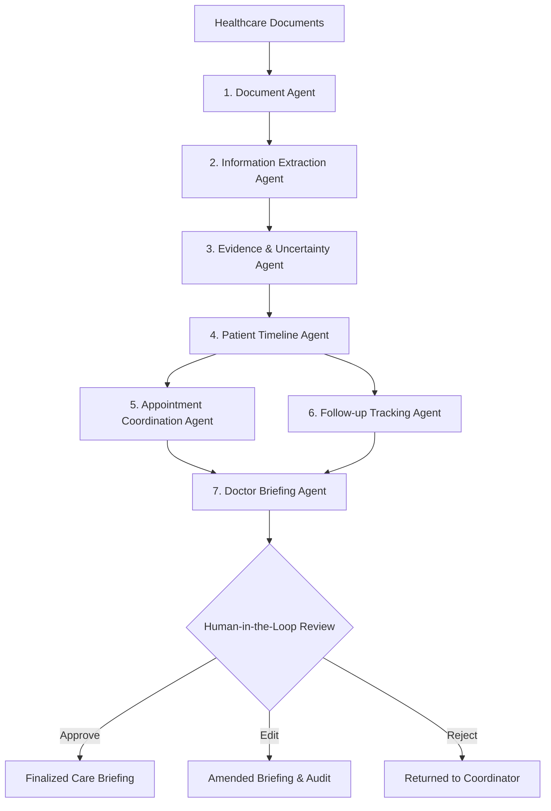

# Agent Workflow & Orchestration Specification

## Agent Pipeline Flowchart



## Detailed Agent Descriptions

### 1. Document Agent (`document_agent.py`)
- **Input**: Raw document filename and text content.
- **Responsibility**: Identifies document type (`LAB_REPORT`, `PRESCRIPTION`, `CLINICAL_NOTE`, `APPOINTMENT`, `REFERRAL`, `DISCHARGE`, `OTHER`).
- **Date Invariant**: Identifies explicit dates in text using strict patterns. **Never hallucinates or invents dates.**

### 2. Information Extraction Agent (`extraction_agent.py`)
- **Responsibility**: Extracts structured facts, clinical encounters, and administrative requirements.
- **Output Schema**:
  ```json
  {
    "information": "Fasting Blood Glucose: 108 mg/dL",
    "category": "LAB_REPORT",
    "status": "FACT",
    "confidence": 0.98,
    "source_document_id": "doc-101",
    "source_location": "Page 1, Chemistry Section",
    "evidence_text": "Fasting Blood Glucose: 108 mg/dL [Flag: High]",
    "requires_human_review": false
  }
  ```

### 3. Evidence & Uncertainty Agent (`evidence_agent.py`)
- **Responsibility**: Classifies claims into `FACT`, `UNCERTAIN`, `MISSING`, or `ASSUMPTION`.
- Identifies missing administrative prerequisites (e.g. absence of signed referral authorization slip) and marks `requires_human_review = True`.

### 4. Patient Timeline Agent (`timeline_agent.py`)
- **Responsibility**: Produces chronological milestones linked to source document IDs and event dates.

### 5. Appointment Coordination Agent (`appointment_agent.py`)
- **Responsibility**: Extracts appointment details and generates administrative prep checklists.
- **Safe Administrative Phrasing**:
  - Valid: *"Referral document was not found in uploaded records."*
  - Prohibited: *"Patient medically needs a referral."*

### 6. Follow-up Agent (`followup_agent.py`)
- **Responsibility**: Tracks medication synchronization dates, routine laboratory follow-up timelines, and archive retrieval tasks.

### 7. Doctor Briefing Agent (`briefing_agent.py`)
- **Responsibility**: Synthesizes a structured clinician briefing backed by traceable evidence citations.
- Includes mandatory non-diagnostic disclaimer and requires human sign-off before finalization.
