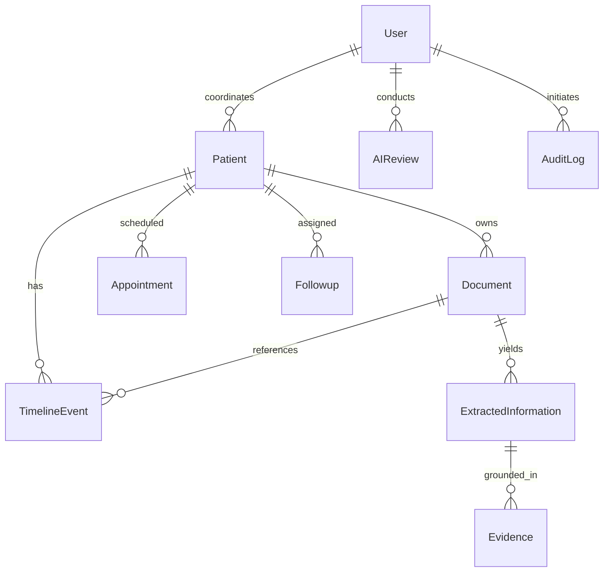

# Database Architecture & Entity Relationships

## Relational Entity-Relationship Diagram

## Tables & Storage Invariants

1. `users`: Stores user identity, hashed passwords (bcrypt), and roles (`PATIENT`, `CARE_COORDINATOR`, `CLINICIAN`, `ADMIN`).
2. `patients`: Stores patient profile, date of birth, emergency contacts, and assigned coordinator.
3. `documents`: Stores raw text, file metadata, explicit document date, and processing status.
4. `extracted_information`: Stores structured facts extracted by Extraction Agent.
5. `evidence`: Stores verbatim quote, confidence score, and classification status (`FACT`, `UNCERTAIN`, `MISSING`, `ASSUMPTION`).
6. `timeline_events`: Chronological milestones tied back to source documents.
7. `appointments`: Scheduled consultations, location, and administrative preparation checklists.
8. `followups`: Documented administrative follow-ups with target deadlines and completion state.
9. `ai_reviews`: Human-in-the-Loop review log storing original output, edited output, action, reviewer ID, and timestamp.
10. `audit_logs`: Tamper-evident operational audit trail capturing all system events.
